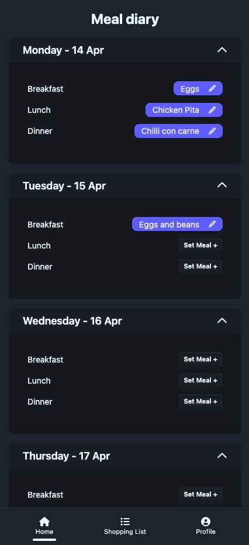
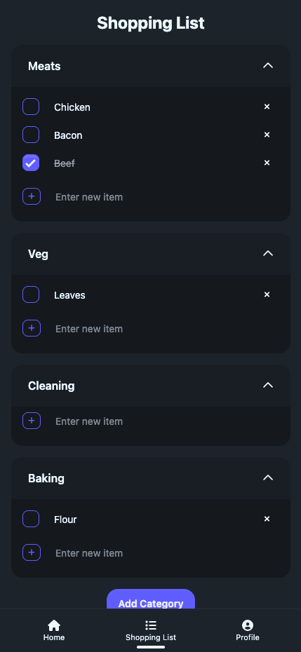

# Meal diary

An application to plan the weeks meals!

A food diary and shopping list that are shareable amongst your household with family groups.

  
  

## How to install (DEV)

### API

1) `cd api`
2) `npm i`
3) Set environment variables like in .env.example
i) DB can be local postgres db from docker-compose.yml, for quick startup
ii) `WEBHOOK_BASE_URL` is nuxt server address with path `/api/webhook`
4) `npm run dev` to start

### Frontend

1) `cd frontend`
2) `npm i`
3) Set environment variables like in .env.example
i) Environment variables just contains URL of api
4) `npm run dev` to start

## Deployment currently

### DB
The postgres database is currently deployed on AWS RDS.

### API & Frontend
Will be deployed on AWS via github actions on merge to master. Will utilise ECR, ECS and perhaps codebuild if necessary.