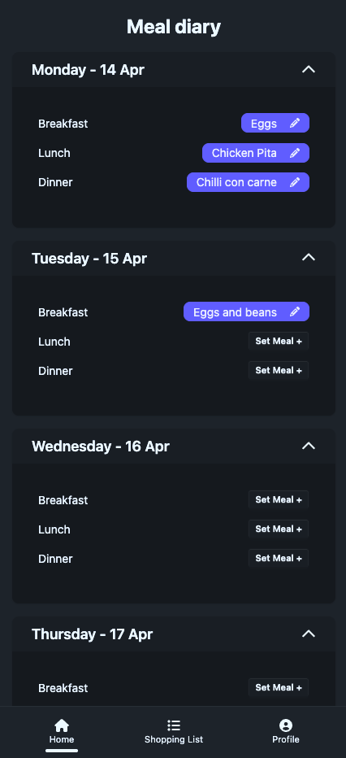
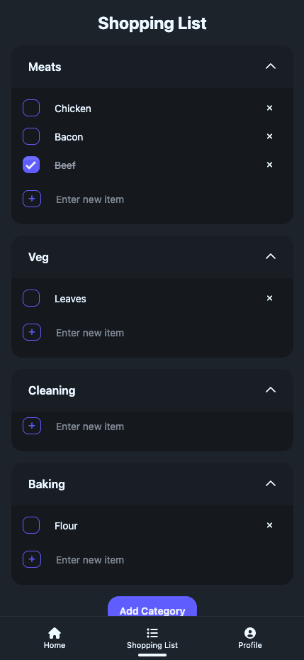

# Meal diary

An application to plan the weeks meals!

A food diary and shopping list that are shareable amongst your household with family groups.

<div>
  
  
</div>

## How to install (DEV)

This repo is an npm workspaces monorepo. Install once from the root:

```bash
npm install
```

### Environment

- **API** — copy `api/.env.example` to `api/.env`. DB can be the local Postgres from `docker-compose.yml`. Set `WEBHOOK_BASE_URL` to the Nuxt server address with path `/api/webhook`.
- **Frontend** — copy `frontend/.env.example` to `frontend/.env`. Set `BASE_URL` to the API URL (e.g. `http://localhost:3001`).
- **Mobile** — copy `apps/mobile/.env.example` to `apps/mobile/.env`. Set `EXPO_PUBLIC_API_URL` to the API URL (`http://10.0.2.2:3001` for Android emulator).

### Run locally (host)

```bash
# API (port 3001)
npm run dev --workspace=meal-diary-api

# Frontend (port 3000)
npm run dev --workspace=nuxt-app

# Mobile (Expo)
npm run dev:mobile

# Or API + frontend via Turborepo
npm run dev
```

### Run with Docker Compose

Starts Postgres, API, and frontend with a single root install:

```bash
docker compose up
```

### Tests

```bash
# Unit tests (API vitest, etc.)
npm test

# Frontend Cypress e2e (requires API + frontend running)
npm run test:e2e
```

## Monorepo layout

```
meal-diary/
  api/                  # Express API
  frontend/             # Nuxt app
  apps/mobile/          # Expo React Native app (iOS + Android)
  packages/shared/      # Shared types and constants
```

## Deployment currently

### DB
The postgres database is currently deployed on Railway.

### API & Frontend
Deployed on Railway
